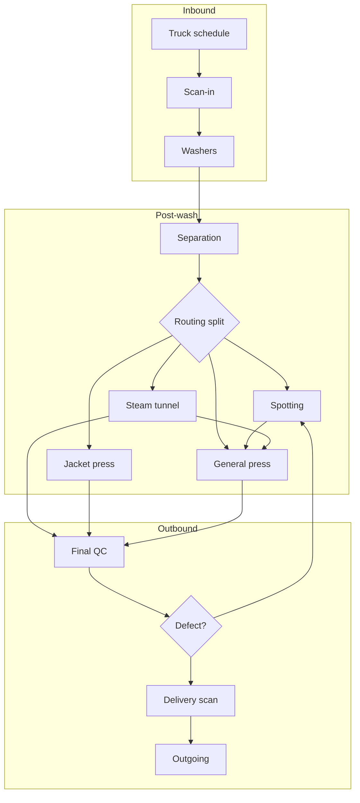

# Plant simulation (time-analysis)

## 1. Purpose

This repository is a **config-driven discrete-event simulation (DES)** framework for multi-stage processing plants. Parameters, calendars, routing, and policies are declared in YAML; Python validates configuration, runs a SimPy model, and reports KPIs.

The codebase is plant-agnostic: numeric and operational values belong in local `config/` and `data/` directories (gitignored). Use [`config.example/`](config.example/) as a structural template.

Run from **WSL** with the project virtualenv ([Setup](#setup)).

---

## 2. Factory operation flow

Scheduled arrivals inject work into a linear front end (scan-in → wash → separation), then into parallel finishing paths, quality control, and a final outbound stage.



**Inbound.** Arrivals add items. Scan-in worker counts can switch under configured resource conditions.

**Wash.** Washer resources use batch-style cycle parameters. Work after the wash cutoff can defer to the next open time.

**Post-wash.** Separation feeds a percentage split across spotting, steam, jacket press, or general press. Steam-exit routing is configurable.

**Outbound.** QC defects may loop through spotting and re-press up to a limit, then delivery scanning. Outbound timing follows the configured delivery policy.

The engine enforces per-item stage ordering and per-stage worker capacity limits.

---

## 3. Configuration

Not committed to git. Copy from [`config.example/`](config.example/):

```bash
mkdir -p config/scenarios data
cp config.example/baseline.yaml config/baseline.yaml
cp config.example/truck_schedule.example.csv data/truck_schedule.csv
```

Optional overlays: `config/scenarios/<name>.yaml` (deep-merged onto baseline).

| Section | Role |
| -------- | ------ |
| `calendar` | Operating days, open time, wash cutoff |
| `items_per_truck` | Default items per truck |
| `resources.washers` | Washer id, cycle, capacity, count |
| `stages.*` | Workers, times/throughput, scan flags, defect rate, labor role |
| `scan_seconds_per_item` | Extra scan time where required |
| `routing.*` | Percentage splits |
| `policies.*` | Batching, cutoff, staffing, QC rework, outbound delivery |
| `loss_model` | Loss rate parameters |
| `labor.rates_by_role` | Hourly rates |
| `economics` | Capex / opex fields for comparison scripts |
| `inputs.truck_schedule` | Path to schedule CSV under `data/` |
| `objectives` | Horizon, delivery deadline |
| `optimization.bounds` | Sweep ranges |
| `sensitivity.ranges` | Optional sensitivity bands |
| `constraints` | Optional limits |
| `ramp` | Optional time-varying parameters |

Schedule CSV columns: `day_of_week`, `arrival_time`, `truck_count`, `direction` (`incoming` / `outgoing`).

---

## 4. Scripts

From repo root with venv active (`python scripts/...`). Requires local `config/baseline.yaml` and the schedule file it references.

| Script | Role |
| ------ | ------ |
| [`scripts/run_baseline.py`](scripts/run_baseline.py) | Run baseline config; print KPIs; write JSON under `outputs/` |
| [`scripts/run_compare.py`](scripts/run_compare.py) | Run baseline and each `config/scenarios/*.yaml`; write comparison scorecard |
| [`scripts/sweep.py`](scripts/sweep.py) | Grid over `optimization.bounds` |
| [`scripts/calibrate.py`](scripts/calibrate.py) | Validate config and schedule; summarize inbound volume |
| [`scripts/serve_viz.py`](scripts/serve_viz.py) | Local web UI: facility flow map from `config/baseline.yaml` |

Tests: `pytest` (fixtures only). `pytest tests/test_flow_invariants.py -v` for pipeline invariants.

### Flow visualizer

Group-based **pipeline** map (horizontally scrollable): **Inbound** → **Wash** → **Separation** → stage-type groups (**Spotting**, **Steam**, **Jacket press**, **General press**, **Final QC**, **Delivery scan**, **Outbound**). Local baseline disables scan-in (shown as “Scan bypassed”); scenarios with `scan_in.enabled: true` show scan workers. Washers use fill-first batching in the sim; BIN gradient = basket fill, DRUM = batch only while cycling.

**Roadmap (not built yet):** drag/reposition groups and blocks in the browser as a layout sandbox (e.g. add pressers, remove washers), then edit distribution schemas (FIFO / batch / split) in the UI and re-run sim to hunt max throughput. The API already returns stable block ids, `flow_next` chains, and `layout_meta.editable: false` until that work lands.

```bash
python scripts/serve_viz.py
```

Opens http://127.0.0.1:8765/ — runs the simulator and animates flow. **Snapshot every N min** controls how often queue/washer state is recorded (scrubber); **playback FPS × sim min/frame** controls Play speed only. Use **Full week** for 7 operating days. Sidebar overrides are in-memory only (they do not write YAML).

---

Create local config from `config.example/`, then `python scripts/run_baseline.py`.

`config/`, `data/`, `outputs/`, and `.venv/` are gitignored.
